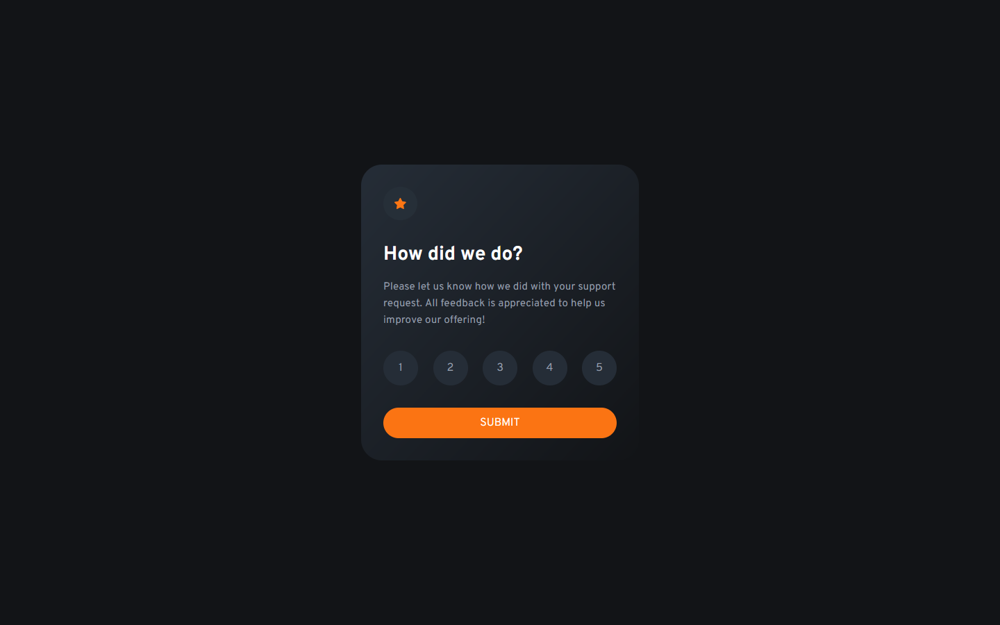

# Frontend Mentor - Interactive rating component solution

This is a solution to the [Interactive rating component challenge on Frontend Mentor](https://www.frontendmentor.io/challenges/interactive-rating-component-koxpeBUmI). Frontend Mentor challenges help you improve your coding skills by building realistic projects.

## Table of contents

- [Overview](#overview)
  - [The challenge](#the-challenge)
  - [Screenshot](#screenshot)
  - [Links](#links)
- [My process](#my-process)
  - [Built with](#built-with)
  - [What I learned](#what-i-learned)
  - [Continued development](#continued-development)
- [Author](#author)

## Overview

### The challenge

Users should be able to:

- View the optimal layout for the app depending on their device's screen size
- See hover states for all interactive elements on the page
- Select and submit a number rating
- See the "Thank you" card state after submitting a rating

### Screenshot

### Links

- Solution URL: [Add solution URL here](https://your-solution-url.com)
- Live Site URL: [https://interactive-rating-component-ai.netlify.app/](https://interactive-rating-component-ai.netlify.app/)

## My process

### Built with

- Vanilla JavaScript
- Semantic HTML5 markup
- CSS custom properties
- Flexbox

### What I learned

In this project I've practiced my CSS and JS skills, specifically CSS Flexbox and DOM Manipulations using Vanilla Javascript.

### Continued development

In the future I'd like to get more comfortable with CSS Grid and start to use it where it's appropriate.

## Author

- Frontend Mentor - [@AndrijaIvkovic1](https://twitter.com/AndrijaIvkovic1)
- Twitter - [@andrijaivkovic](https://www.twitter.com/andrijaivkovic)
